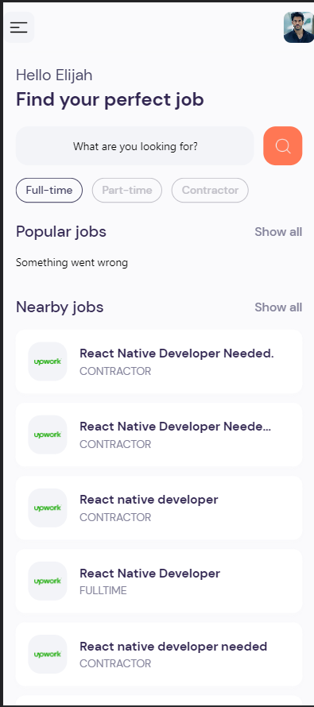
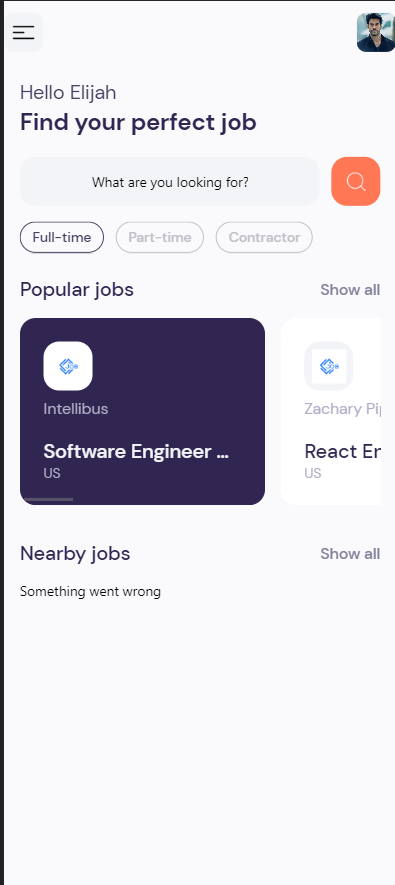
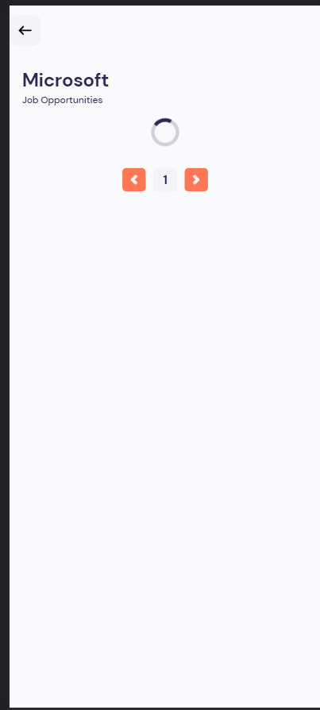
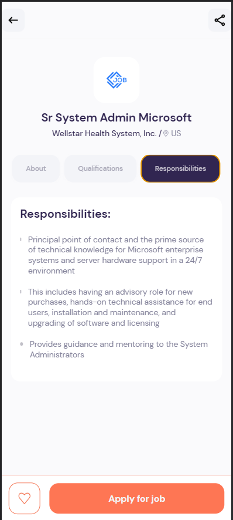
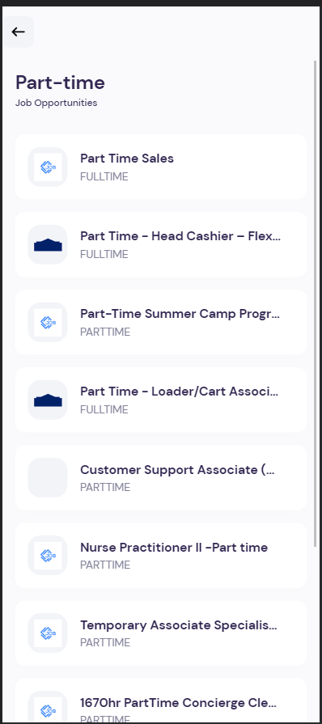

# Quick application for learning purposes.

api key is **not** premium









## Design from: https://dribbble.com/shots/11867493-Job-finder-Mobile-UI-Job-list


# Expo Router Example

Use [`expo-router`](https://expo.github.io/router) to build native navigation using files in the `app/` directory.

## 🚀 How to use

```sh
npx create-react-native-app -t with-router
```

## 📝 Notes

- [Expo Router: Docs](https://expo.github.io/router)
- [Expo Router: Repo](https://github.com/expo/router)
- [Request for Comments](https://github.com/expo/router/discussions/1)
